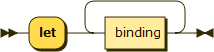
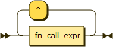
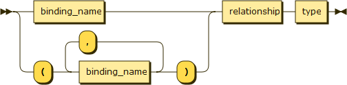
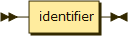
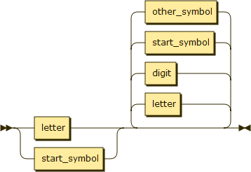
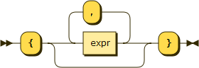
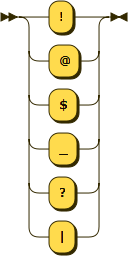

# Impero EBNF and Railroad diagram

- EBNF
  - [begin_stmt](#begin_stmt)
  - [lib_stmt](#lib_stmt)
  - [use_stmt](#use_stmt)
  - [do_stmt](#do_stmt)
  - [let_stmt](#let_stmt)
  - [pattern_stmt](#pattern_stmt)
  - [simple_stmt](#simple_stmt)
  - [for_all_stmt](#for_all_stmt)
  - [there_exists_stmt](#there_exists_stmt)
  - [function_call_expr](#function_call_expr)
  - [binding](#binding)
  - [expr](#expr)
  - [relational_expr](#relational_expr)
  - [range_expr](#range_expr)
  - [additive_expr](#additive_expr)
  - [multiplicative_expr](#multiplicative_expr)
  - [power_expr](#power_expr)
  - [primary_expr](#primary_expr)
  - [binding_type](#binding_type)
  - [relationship](#relationship)
  - [type](#type)
  - [binding_name](#binding_name)
  - [identifier](#identifier)
  - [constant](#constant)
  - [set](#set)
  - [tuple](#tuple)
  - [range](#range)
  - [float](#float)
  - [digit](#digit)
  - [letter](#letter)
  - [other_symbol](#other_symbol)
  - [start_symbol](#start_symbol)

###### begin\_stmt
```EBNF
begin_stmt ::= lib_stmt
             | use_stmt
             | let_stmt
             | do_stmt
```
<p align="left">
  <a href="">
    
  </a>
</p>

###### lib\_stmt
```EBNF
lib_stmt ::= "lib" binding_name
```
<p align="left">
  <a href="">
    
  </a>
</p>

###### use\_stmt
```EBNF
use_stmt ::= "use" binding_name
```
<p align="left">
  <a href="">
    
  </a>
</p>

###### do\_stmt
```EBNF
do_stmt ::= "do" function_call
```
<p align="left">
  <a href="">
    
  </a>
</p>

###### let\_stmt
```EBNF
let_stmt ::= "let" binding+
```
<p align="left">
  <a href="">
    
  </a>
</p>

###### binding
```EBNF
binding ::= binding_name '=' pattern_stmt ':' expr (',' expr)*
```
<p align="left">
  <a href="">
    
  </a>
</p>

###### pattern\_stmt
```EBNF
pattern_stmt ::= for_all_stmt
               | there_exists_stmt
               | simple_stmt
               | pattern_stmt (',' pattern_stmt)+
```
<p align="left">
  <a href="">
    
  </a>
</p>

###### simple\_stmt
```EBNF
simple_stmt ::= binding_type
```
<p align="left">
  <a href="">
    
  </a>
</p>

###### expr
```EBNF
expr ::= relational_expr
       | (expr '=' relational_expr)
       | (expr '~' relational_expr)
```
<p align="left">
  <a href="">
    
  </a>
</p>

###### relational\_expr
```EBNF
relational_expr ::= range_expr
                  | (relational_expr '>' range_expr)
                  | (relational_expr '>=' range_expr)
                  | (relational_expr '<' range_expr)
                  | (relational_expr '<=' range_expr)
```
<p align="left">
  <a href="">
    
  </a>
</p>

###### range\_expr
```EBNF
range_expr ::= additive_expr
             | (range_expr '..' additive_expr)
```
<p align="left">
  <a href="">
    
  </a>
</p>


###### additive\_expr
```EBNF
additive_expr ::= multiplicative_expr
                | (additive_expr '+' multiplicative_expr)
                | (additive_expr '-' multiplicative_expr)
```
<p align="left">
  <a href="">
    
  </a>
</p>

###### multiplicative\_expr
```EBNF
multiplicative_expr ::= power_expr
                      | (multiplicative_expr '*' power_expr)
                      | (multiplicative_expr '/' power_expr)
                      | (multiplicative_expr '%' power_expr)
```
<p align="left">
  <a href="">
    
  </a>
</p>

###### power\_expr
```EBNF
power_expr ::= primary_expr
             | (power_expr '^' primary_expr)
```
<p align="left">
  <a href="">
    
  </a>
</p>

###### function\_call\_expr
```EBNF
function_call_expr ::= binding_name ('.' | '∘') expr
```
<p align="left">
  <a href="">
    
  </a>
</p>

###### primary\_expr
```EBNF
primary_expr ::= function_call_expr
               | binding_name
               | constant
               | '(' expr ')'
```
<p align="left">
  <a href="">
    
  </a>
</p>

###### for\_all\_stmt
```EBNF
for_all_stmt ::= ("for" "all" | '∀') (binding_type | '(' binding_type (',' binding_type)+ ')')
```
<p align="left">
  <a href="">
    
  </a>
</p>

###### there\_exists\_stmt
```EBNF
there_exists_stmt ::= ("there" "exists" | '∃') (binding_type | '(' binding_type (',' binding_type)+ ')')
```
<p align="left">
  <a href="">
    
  </a>
</p>

###### binding\_type
```EBNF
binding_type ::= binding_name relationship type
```
<p align="left">
  <a href="">
    
  </a>
</p>

###### relationship
```EBNF
relatioship ::= ("subset" "of" | '⊆')
              | ("in" | '∈')
```
<p align="left">
  <a href="">
    
  </a>
</p>

###### type
```EBNF
type ::= 'Z'
       | 'N'
       | 'R'
       | "Char"
       | "Universe"
       | binding_name
```
<p align="left">
  <a href="">
    
  </a>
</p>

###### binding\_name
```EBNF
binding_name ::= identifier
```
<p align="left">
  <a href="">
    
  </a>
</p>

###### identifier
```EBNF
identifier ::= (letter | start_symbol) (letter | digit | start_symbol | other_symbol )*
```
<p align="left">
  <a href="">
    
  </a>
</p>

###### constant
```EBNF
constant ::= number
           | char
           | tuple
           | set
```
<p align="left">
  <a href="">
    
  </a>
</p>

###### set
```EBNF
set ::= '{' expr (',' expr)* '}'
```
<p align="left">
  <a href="">
    
  </a>
</p>

###### tuple
```EBNF
tuple ::= '(' expr (',' expr)* ')'
```
<p align="left">
  <a href="">
    
  </a>
</p>

###### range
```EBNF
range ::= expr ".." expr
```
<p align="left">
  <a href="">
    
  </a>
</p>

###### float
```EBNF
float ::= digit+ '.' digit
```
<p align="left">
  <a href="">
    
  </a>
</p>

###### digit
```EBNF
digit ::= '0'
        | '1'
        | "..."
        | '9'
```
<p align="left">
  <a href="">
    
  </a>
</p>

###### letter
```EBNF
letter ::= 'a'
         | 'b'
         | "..."
         | 'z'
         | 'A'
         | ".."
         | 'Z'
```
<p align="left">
  <a href="">
    
  </a>
</p>

###### other\_symbol
```EBNF
other_symbol ::= '+'
               | '-'
               | '*'
               | '/'
               | '%'
               | '^'
               | '<'
               | '>'
```
<p align="left">
  <a href="">
    
  </a>
</p>

###### start\_symbol
```EBNF
start_symbol ::= '!'
               | '@'
               | '$'
               | '_'
               | '?'
               | '|'
```
<p align="left">
  <a href="">
    
  </a>
</p>

###### Powered by Railroad Diagram Generator
<p align="left">
  <a href="">
    
  </a>
</p>
