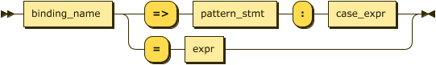
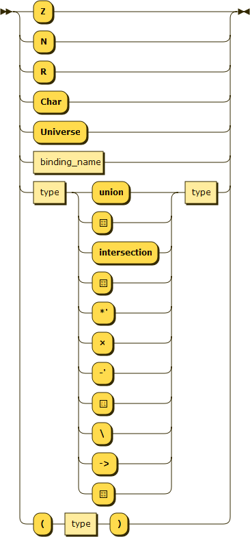

# Impero 
> Impero is inspired on set comprehensions and discrete math. Its name derives from the so-famous phrase "divide and conquer"
> (from Latin dīvide et imperā, hence impero : to give orders, command / to rule, hold sway).

#### Current Info
- The models will probably change once the grammar is not (yet) complete.

#### Dependencies
  - `parsec`: Install with the command: `cabal install parsec`

#### Example
```Haskell
let
  numberSet = for all x subset of Z: x
  square = for all x in numberSet: x ^ 2
  allEven = for all n in numberSet: (x % 2) = 0
  ifThereIsANumberGreaterThan10 = there exists n in numberSet: n > 10
do
  square .
  allEven .
  ifTheresIsANumberGreaterThan10 .
  {2, 4, 6, 8, 10, 12}
```

The code above can also be written:
```Haskell
let
  numberSet = ∀x ⊆ Z: x
  square = ∀x ∈ numberSet: x ^ 2
  allEven = ∀n ∈ numberSet: (x % 2) = 0
  ifThereIsANumberGreaterThan10 = ∃n ∈ numberSet: n > 10
do
  square .
  allEven .
  ifTheresIsANumberGreaterThan10 .
  {2, 4, 6, 8, 10, 12}
```

###### output
```
{4, 16, 36, 64, 100, 144}
```

#### EBNF RailRoad Diagram
###### do_stmt
```EBNF
do_stmt ::= "do" expression
```
<p align="left">
  <a href="">
    
  </a>
</p>

###### let_stmt
```EBNF
let_stmt ::= "let" binding+
```
<p align="left">
  <a href="">
    
  </a>
</p>

###### expression
```EBNF
expression ::= ('-')? term  (('+' | '-') expression)?
             | '(' expression ')'
```
<p align="left">
  <a href="">
    
  </a>
</p>

###### term
```EBNF
term ::= factor (('*' | '/' | '%' | '^') factor)?
```
<p align="left">
  <a href="">
    
  </a>
</p>

###### factor
```EBNF
factor ::= constant
         | binding_name '.' factor
```
<p align="left">
  <a href="">
    
  </a>
</p>

###### binding
```EBNF
binding ::= binding_name ':' pattern_stmt expression (',' expression)* '.'
```
<p align="left">
  <a href="">
    
  </a>
</p>

###### pattern_stmt
```EBNF
pattern_stmt ::= for_all_stmt
               | there_exists_stmt
               | binding_name
```
<p align="left">
  <a href="">
    
  </a>
</p>

###### for\_all_stmt
```EBNF
for_all_stmt ::= "for" "all" binding_name "in" type
```
<p align="left">
  <a href="">
    
  </a>
</p>

###### there\_exists_stmt
```EBNF
there_exists_stmt ::= "there" "exists" binding_name "in" type
```
<p align="left">
  <a href="">
    
  </a>
</p>

###### type
```EBNF
type ::= 'Z'
       | 'N'
       | 'R'
       | "Universe"
       | identifier
```
<p align="left">
  <a href="">
    
  </a>
</p>

###### binding_name
```EBNF
binding_name ::= identifier
```
<p align="left">
  <a href="">
    
  </a>
</p>

###### identifier
```EBNF
identifier ::= (letter | start_symbol) (letter | digit | symbol )*
```
<p align="left">
  <a href="">
    
  </a>
</p>

###### constant
```EBNF
constant ::= number
           | string
```
<p align="left">
  <a href="">
    
  </a>
</p>

###### string
```EBNF
string ::= '"' char* '"'
```
<p align="left">
  <a href="">
    
  </a>
</p>

###### number
```EBNF
number ::= digit+
         | float
```
<p align="left">
  <a href="">
    
  </a>
</p>

###### float
```EBNF
float ::= digit+ '.' digit
```
<p align="left">
  <a href="">
    
  </a>
</p>

###### digit
```EBNF
digit ::= '0'
        | '1'
        | "..."
        | '9'
```
<p align="left">
  <a href="">
    
  </a>
</p>

###### letter
```EBNF
letter ::= 'a' 
         | 'b'
         | "..."
         | 'z'
         | 'A'
         | ".."
         | 'Z'
```
<p align="left">
  <a href="">
    
  </a>
</p>

###### start_symbol
```EBNF
start_symbol ::= '~'
               | '!' 
               | '@'
               | '#'
               |'$'
               | '_'
               | '?'
               | ('+' | '-' | '*' | '/' | '^' | '%' | '>' | '<' | '=') start_symbol+
```
<p align="left">
  <a href="">
    
  </a>
</p>
